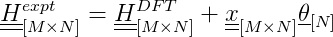

# Thermochemistry
This repository contains a Python library for Thermochemistry developed by the Vlachos Research Group at the University of Delaware.

## Implemented features
1. DFT-generated data can be input using Excel and special column header names.
2. Ideal Gas and Harmonic Thermo statistical thermodynamic models have been implemented. Framework to create new models is straightforward (classes only need to: state explicitly attributes required in the `__init__` method, contain the methods `get_CpoR(Ts)`, `get_HoRT(Ts)`, `get_SoR(Ts)`, and `get_GoRT(Ts)`).
3. Thermdat empirical model has been implemented. Given Cp as a function of temperature, a reference temperature and associated enthalpy and entropy, NASA polynomials can be generated.
4. Framework to convert statistical thermodynamic model to empirical models implemented. See [Thermochemistry.examples.VASP_to_thermdat](https://github.com/VlachosGroup/Thermochemistry/tree/master/examples/VASP_to_thermdat).

## Planned features
1. Automatically read DFT-generated data directly from:
   - VASP
   - Gaussian
2. More complex statistical thermodynamic models like the Rigid Rotor model
3. Read and write to other empirical formats formats, including:
   - Shomate polynomials

## Developers
- Gerhard Wittreich, P.E. (wittregr@udel.edu)
- Jonathan Lym (jlym@udel.edu)

## Dependencies
- Python3
- [Atomic Simulation Environment](https://wiki.fysik.dtu.dk/ase/): Used for I/O operations and to calculate thermodynamic properties
- [Numpy](http://www.numpy.org/): Used for vector and matrix operations
- [Pandas](https://pandas.pydata.org/): Used to import data from Excel files
- [SciPy](https://www.scipy.org/): Used for fitting heat capacities.
- [Matplotlib](https://matplotlib.org/): Used for plotting thermodynamic data

## Getting Started
1. Download the repository to your local machine
2. Add to parent folder to PYTHONPATH

___

## Outline to convert DFT-generated data to empirical models
*Code can be found in [Thermochemistry.examples.VASP_to_thermdat](https://github.com/VlachosGroup/Thermochemistry/tree/master/examples/VASP_to_thermdat)*
1. **Read the Reference data.** Reference data is needed to adjust DFT enthalpies to real-world enthalpies. It is typical to use gas-phase molecules since experimental data is readily available. The number of references should be greater than or equal to the number of elements. 

For this example, our references are specified in an Excel file. The experimental data is specified using the reference dimensionless enthalpy of formation field, `HoRT_ref`. The computational data is specified using the fields: `potentialenergy` (electronic energy in eV), `vib_wavenumber` (vibrational frequencies in 1/cm), `geometry` (linear, nonlinear, monatomic), `atoms` (the location of the CONTCAR files), and the `thermo_model` to use (IdealGasThermo). `BaseThermo` is the parent class of empirical classes. For referencing, `BaseThermo` is sufficient but any empirical model could have been used.

```python
from Thermochemistry.io_.excel import read_excel
from Thermochemistry.models.empirical import BaseThermo
from Thermochemistry.models.empirical.references import References

refs_path = './references.xlsx'
refs_input = read_excel(io=refs_path)
refs = References([BaseThermo(**ref_input) for ref_input in refs_input])
```

2. **Use the references to calculate the offset between DFT data and experimental data.** The offset is calculated for each element. Therefore, the element composition should be specified in the Excel file. The elemental composition can be specified using the `formula` keyword where the formula unit can be typed (e.g. H2O) or by using the `elements` keyword where each element has a column indicating the number in a formula unit. [Read below if you're interested on how referencing is done](#referencing).

```python
refs.calc_offset()
```

3. **Read the DFT-generated data for the interested species.** This is similar to Step 1 but the `T_ref` and `HoRT_ref` fields are not required.

```python
thermdats_data = read_excel(io=thermdats_in_path)
thermdats = [Thermdat(**thermdat_data) for thermdat_data in thermdats_data]
```

4. **Calculate the reference enthalpy using the offset calculated in Step 2 and fit to the desired empirical formula.**

```python
from Thermochemistry import constants as c
from Thermochemistry.models.empirical.thermdat import Thermdat

for thermdat_specie in thermdats:
	thermdat_specie.T_ref = c.T0('K')
	thermdat_specie.HoRT_ref = thermdat_specie.thermo_model.get_HoRT(Ts=c.T0('K')) + refs.get_specie_offset(thermdat_specie.elements)
	thermdat_specie.calc_nasa(T_low=T_low, T_high=T_high, T_ref=c.T0('K'))
```

5. **Save the coefficients of the empirical form.**

```python
from Thermochemistry.io_.thermdat import write_thermdat

write_thermdat(thermdats=thermdats, filename=thermdats_out_path)
```

___

## Referencing
Enthalpies calculated using VASP (and some other computational methods) have different references than standard references (i.e. the enthalpy of formation of pure substances, like O<sub>2</sub> or Pt, is not necessarily zero). This difference makes it difficult to ensure thermodynamic consistency for our mechanisms since we may be mixing experimental gas thermodynamics with computational surface thermodynamics. In order to make the references consistent, we find a correction factor for each element by solving the equation:



where M is the number of reference species, N is the number of elements, H<sup>expt</sup> is the experimental standard enthalpies, H<sup>DFT</sup> is the standard enthalpies calculated using DFT, x is a matrix that describes the composition of the references (each row represents a specie, each column represents an element), and θ is the correction for each element.

The equation can be solved using a Least Squares approach. The correction factor can then be added to subsequent species calculated through DFT to ensure consistent references.

___

## Input and Output
Reading from and writing to different formats is an active area for development. These operations can be found in `Thermochemistry.io_`. We will discuss reading DFT data via Excel.

### Excel
A spreadsheet with DFT data can be read using `Thermochemistry.io_.excel.read_excel` function. It uses the Pandas function [`pandas.read_excel`](https://pandas.pydata.org/pandas-docs/version/0.23/generated/pandas.read_excel.html) to facilitate flexible reading options (such as rows to skip or what to recognize as a NaN).

Below, we show the contents of the references.xlsx spreadsheet found in `Thermochemistry.examples.VASP_to_thermdat` (the description of the fields have been omitted here due to difficult of formatting). The first row corresponds to the field name and the second row by default is ignored so comments can be inputted here. Some fields do not require any additional processing, like `name`, `potentialenergy`, and `geometry`. However, in some cases the field does need further processing, like `atoms` (the value is only the location to find a file to read and not the actual atoms object) or `elements~H` (in this case, the field name needs to be processed to show this header represents hydrogen atoms in a formula unit). Special parsing instructions can be found and added to the [`Thermochemistry.io_.excel.read_excel`](https://github.com/VlachosGroup/Thermochemistry/blob/master/io_/excel.py#L45) function.


| name | phase | elements~H | elements~O | thermo_model                                                  | T_ref | HoRT_ref | potentialenergy | geometry  | atoms                                                                                                           | symmetrynumber | spin | vib_wavenumber~1 | vib_wavenumber~2 | vib_wavenumber~3 |
|------|-------|------------|------------|---------------------------------------------------------------|-------|----------|-----------------|-----------|-----------------------------------------------------------------------------------------------------------------|----------------|------|------------------|------------------|------------------|
| H2   | G     | 2          | 0          | Thermochemistry.models.statmech.idealgasthermo.IdealGasThermo | 298   | 0        | -6.7598         | linear    | G:\My Drive\UDel Documents\UDel Research\Thermochemistry\Thermochemistry\examples\VASP_to_thermdat\H2\CONTCAR   | 2              | 0    | 4306.1793        |                  |                  |
| H2O  | G     | 2          | 1          | Thermochemistry.models.statmech.idealgasthermo.IdealGasThermo | 298   | -97.606  | -14.2209        | nonlinear | G:\My Drive\UDel Documents\UDel Research\Thermochemistry\Thermochemistry\examples\VASP_to_thermdat\H2O\CONTCAR  | 2              | 0    | 3825.434         | 3710.2642        | 1582.432         |


The `Thermochemistry.io_.excel.read_excel` function returns a list of dictionaries. The dictionaries contain field-to-value pairings that can be used to initilize objects using the keyword argument syntax (**kwargs). This is shown in Step 1 and Step 3 of the section: [Outline to convert DFT-generated data to empirical models](#outline-to-convert-dft-generated-data-to-empirical-models)

___

## Adding a Statistical Thermodynamic Model
The overall goal is to create a framework that allows models to be added quickly and easily. For this page, we will be using the Harmonic Thermo model (located in `Thermochemistry.models.statmech.harmonicthermo`) as an example. The only requirement for a class is to have the methods: get_CpoR, get_HoRT, get_SoR, and get_GoRT. `Ts` must be an argument and represents the temperature(s) in K. The initialization of the HarmonicThermo class is as follows:

```python
from ase import thermochemistry

def __init__(self, vib_energies, potentialenergy=0.0):
	self.model = thermochemistry.HarmonicThermo(
		vib_energies = vib_energies,
		potentialenergy = potentialenergy)
```
Objects made from this class hold an [`ase.thermochemistry.harmonicthermo`](https://wiki.fysik.dtu.dk/ase/ase/thermochemistry/thermochemistry.html#ase.thermochemistry.HarmonicThermo) object and uses it to calculate the enthalpy and entropy. In this case, `calc_HoRT` calls the `get_internal_energy` method in the ASE object.

```python
from Thermochemistry import constants as c

def get_HoRT(self, Ts, verbose = False):
	"""
	Returns the dimensionless enthalpy at a given temperature

	Parameters
		Ts - float or (N,) ndarray
			Temperature(s) in K
		verbose - bool
			Whether a table breaking down each contribution should be printed
	Returns
		float or (N,) ndarray
			Dimensionless heat capacity (H/RT) at the specified temperature
	"""
	#Testing if Ts is a single value or an array
	try:
		iter(Ts)
	except TypeError:
		#Cannot be iterated over and therefore is a single value
		HoRT = self.model.get_internal_energy(temperature=Ts, verbose=verbose)/(c.kb('eV/K') * Ts)
	else:
		#Can be iterated over and therefore is an array
		HoRT = np.zeros_like(Ts)
		for i, T in enumerate(Ts):
			HoRT[i] = self.model.get_internal_energy(temperature=T, verbose=verbose)/(c.kb('eV/K') * T)/(c.kb('eV/K') * T)
	return HoRT
```

However, ASE's HarmonicThermo object does not have a method to calculate heat capacity so we have have to implement it ourselves.

```python
from Thermochemistry.models.statmech.heat_capacity import get_CvoR_vib

def get_CpoR(self, Ts):
	"""
	Calculates the dimensionless heat capacity (Cp/R) at a given temperature.
	If you would like to use different behavior from the default, the
	thermo_model used must have the method 'get_CpoR'.

	Parameters
		Ts - float or (N,) ndarray
			Temperature(s) in K
	Returns
		float or (N,) ndarray
			Dimensionless heat capacity (Cp/R)
	""" 
	return get_CvoR_vib(vib_energies=self.model.vib_energies, Ts=Ts)
```

___

## Adding an Empirical Model
The empirical models are a child class of the `BaseThermo` class (located in `Themochemistry.models.empirical.BaseThermo`). First, we will discuss the `BaseThermo` class. Second, we will show the `Thermdat` class (located in `Thermdat.models.empirical.thermdat.Thermdat`) that builds on it.

### BaseThermo
`BaseThermo` has several attributes that will be applicable to many thermodynamic problems. The initialization is shown below:

```python
import inspect
from Thermochemistry import _pass_expected_arguments

class BaseThermo:
	"""
	The Thermodynamic Parent class. Holds properties of a specie, the 
	statistical-mechanical thermodynamic model.

	Attributes
		name - str
			Name of the specie
		phase - str
			Phase of the specie
				G - gas
				S - surface
		elements - dict
			Composition of the species. Keys of dictionary are elements, 
			values are stoichiometric values in a formula unit
			e.g. CH3OH can be represented as:
			{
				'C': 1,
				'H': 4,
				'O': 1,
			}
		thermo_model - Thermochemistry.thermo_model class or custom class
			Class should have the following methods:
				get_CpoR
				get_HoRT
				get_SoR
				get_GoRT
		T_ref - float
			Reference temperature. Only used for reference species.
		HoRT_ref - float
			Reference dimensionless enthalpy corresponding to T_ref. Only used 
			for reference species.
		notes - str
			Any additional details you would like to include such as source of the data.
	"""

	def __init__(self, name, phase, elements, thermo_model = None, T_ref = None, HoRT_ref = None, notes = None, **kwargs):
		self.name = name
		self.phase = phase
		self.elements = elements
		self.T_ref = T_ref
		self.HoRT_ref = HoRT_ref
		self.notes = notes
		if inspect.isclass(thermo_model):
			#If you're passing a class. Note that the required arguments will be guessed.
			self.thermo_model = _pass_expected_arguments(thermo_model, **kwargs)
		else:
			#If it's an object that has already been initialized
			self.thermo_model = thermo_model
```

### Thermdat
Since the `Thermdat` class is a child of the `BaseThermo` class, it has all the attributes as `BaseThermo`. It also has other parameters related to NASA polynomials. The initialization is shown below:

```python
class Thermdat(BaseThermo):
	"""
	Stores the information for an individual thermdat specie
	Inherits from Thermochemistry.models.empirical.BaseThermo

	The thermodynamic properties are calculated using the following form:
	Cp/R = a[0] + a[1]*T + a[2]*T^2 + a[3]*T^3+a[4]*T^4
	H/RT = a[0] + a[1]*T/2 + a[2]*T^2/3 + a[3]*T^3/4 + a[4]*T^4/5 + a[5]/T
	S/R = a[0]*ln(T) + a[1]*T + a[2]*T^2/2 + a[3]*T^3/3 + a[4]*T^4/4 + a[6]

	Attributes
		T_low - float
			Lower temperature bound (in K)
		T_mid - float
			Middle temperature bound (in K)
		T_high - float
			High temperature bound (in K)
		a_low - (7,) ndarray
			NASA polynomial to use between T_low and T_mid
		a_high - (7,) ndarray
			NASA polynomial to use between T_mid and T_high
	"""
	def __init__(self, T_low=None, T_mid=None, T_high=None, a_low=np.zeros(7), a_high=np.zeros(7), **kwargs):
		super().__init__(**kwargs)
		self.T_low = T_low
		self.T_mid = T_mid
		self.T_high = T_high
		self.a_low = a_low
		self.a_high = a_high
```

Similarly to the [statistical thermodynamic models](#adding-a-statistical-thermodynamic-model), the empirical models have the methods `get_CpoR`, `get_HoRT`, `get_SoR`. As an example, `get_CpoR` is shown below:

```python
def get_CpoR(self, Ts):
	"""
	Calculate the dimensionless heat capacity

	Parameters
		Ts - float or (N,) ndarray
			Temperature(s) in K
	Returns
		float or (N,) ndarray
			Dimensionless heat capacity
	"""
	#Testing if Ts is a single value or an array
	try:
		iter(Ts)
	except TypeError:
		#Cannot be iterated over and therefore is a single value
		a = self.get_a(T=Ts) #Determines whether to use a_low or a_high
		CpoR = get_nasa_CpoR(a=a, T=Ts)
	else:
		#Can be iterated over and therefore is an array
		CpoR = np.zeros_like(Ts)
		for i, T in enumerate(Ts):
			a = self.get_a(T) #Determines whether to use a_low or a_high
			CpoR[i] = get_nasa_CpoR(a=a, T=T)
	return CpoR
```