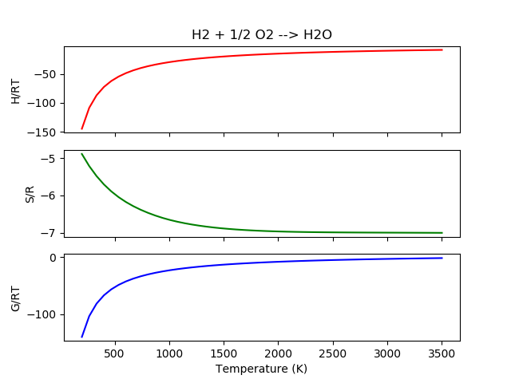

.. _reactions:

Reactions
*********

Reaction
========

Chemical reactions can be modeled using the :class:`pmutt.reaction.Reaction` 
class.

.. autoclass:: pmutt.reaction.Reaction
   :members:

Example
-------

In this section, we calculate the thermodynamic properties of water formation
from hydrogen and oxygen. Nasa polynomials are used in this example but any 
pmutt model object should be compatible. Reaction objects can be initialized 
using the pmutt model objects directly or using a reaction string.

Initialization using pmutt Model Objects
^^^^^^^^^^^^^^^^^^^^^^^^^^^^^^^^^^^^^^^^

In this example, the Nasa objects are created directly in the script.

.. code:: python

   import numpy as np
   from matplotlib import pyplot as plt
   from pmutt.empirical.nasa import Nasa
   from pmutt import reaction as rxn
   
   '''
   Initialize reaction
   '''
   H2O_nasa = Nasa(name='H2O', T_low=200., T_mid=1000., T_high=3500.,
                   elements={'H': 2, 'O': 1}, 
                   a_low=[4.19864056E+00, -2.03643410E-03, 6.52040211E-06, -5.48797062E-09, 1.77197817E-12, -3.02937267E+04, -8.49032208E-01],
                   a_high=[3.03399249E+00, 2.17691804E-03, -1.64072518E-07, -9.70419870E-11, 1.68200992E-14, -3.00042971E+04, 4.96677010E+00])
   H2_nasa = Nasa(name='H2', T_low=200., T_mid=1000., T_high=3500.,
                  elements={'H': 2},
                  a_low=[2.34433112E+00, 7.98052075E-03, -1.94781510E-05, 2.01572094E-08, -7.37611761E-12, -9.17935173E+02, 6.83010238E-01],
                  a_high=[3.33727920E+00, -4.94024731E-05, 4.99456778E-07, -1.79566394E-10, 2.00255376E-14, -9.50158922E+02, -3.20502331E+00])
   O2_nasa = Nasa(name='O2', T_low=200., T_mid=1000., T_high=3500.,
                  elements={'O': 2},
                  a_low=[3.78245636E+00, -2.99673416E-03, 9.84730201E-06, -9.68129509E-09, 3.24372837E-12, -1.06394356E+03, 3.65767573E+00],
                  a_high=[3.28253784E+00, 1.48308754E-03, -7.57966669E-07, 2.09470555E-10, -2.16717794E-14, -1.08845772E+03, 5.45323129E+00])
   rxn_nasa = rxn.Reaction(
                   reactants=[H2_nasa, O2_nasa],
                   reactants_stoich=[1., 0.5],
                   products=[H2O_nasa],
                   products_stoich=[1.])
   
Initialization using reaction string
^^^^^^^^^^^^^^^^^^^^^^^^^^^^^^^^^^^^

In this example, the Nasa objects are read from a thermdat file and 
are assigned to the Reaction object based on the reaction string. This 
way is more convenient if you're dealing with large reaction networks.

.. code:: python

   import os
   import numpy as np
   from matplotlib import pyplot as plt
   from pmutt.io.thermdat import read_thermdat
   from pmutt import pmutt_list_to_dict
   from pmutt import reaction as rxn
   
   '''
   Read the thermdat
   '''
   base_path = os.path.dirname(__file__)
   nasa_list = read_thermdat(os.path.join(base_path, 'thermdat'))
   # Convert list to dictionary so Reaction.from_string can 
   # assign species quickly
   nasa_dict = pmutt_list_to_dict(nasa_list, key='name')
   
   '''
   Create the reaction object
   '''
   reaction_str = 'H2+0.5O2=H2O'
   rxn_nasa = rxn.Reaction.from_string(reaction_str=reaction_str, 
                                       species=nasa_dict)

After the Reaction object is initialized, you can ensure the equation is 
balanced.

.. code:: python

   rxn_nasa.check_element_balance()

Or calculate thermodynamic properties.

.. code:: python

   T = np.linspace(200., 3500.)
   HoRT_rxn = rxn_nasa.get_delta_HoRT(T=T)
   SoR_rxn = rxn_nasa.get_delta_SoR(T=T)
   GoRT_rxn = rxn_nasa.get_delta_GoRT(T=T)

   '''
   Plot the data
   '''
   f, ax = plt.subplots(3, sharex=True)
   ax[0].set_title('H2 + 1/2 O2 --> H2O')
   ax[0].plot(T, HoRT_rxn, 'r-')
   ax[0].set_ylabel('H/RT')
   
   ax[1].plot(T, SoR_rxn, 'g-')
   ax[1].set_ylabel('S/R')
   
   ax[2].plot(T, GoRT_rxn, 'b-')
   ax[2].set_ylabel('G/RT')
   ax[2].set_xlabel('Temperature (K)')
   plt.show()

ChemkinReaction
===============

This is a child class of :class:`~pmutt.reaction.Reaction` but has additional
attributes for reading and writting Chemkin files.

.. autoclass:: pmutt.reaction.ChemkinReaction
   :members:
   :noindex:

Reactions
=========

.. autoclass:: pmutt.reaction.Reactions
   :members:

BEP
===

Bronsted Evans Polyani relationships can be added to 
:class:`~pmutt.reaction.Reaction` objects so the activation energy can be 
estimated using the change in enthalpy.

.. autoclass:: pmutt.reaction.bep.BEP
   :members: